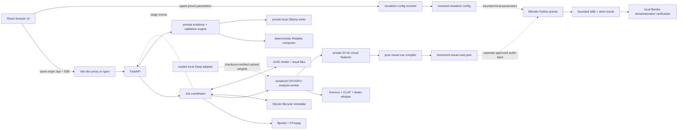

# Architecture

The optional cinematic layer compiles local visual cues into versioned `StoryPlan` and `ShotPlan` artifacts before Blender scene construction. `space-journey-story` consumes the shot plan through a distinct preset boundary, and Mission Control exposes persisted frame/act/shot telemetry plus an atomic local Director review workspace. The browser still talks only to loopback FastAPI services, and audio/media remain local. See [Cinematic Visualizer V2](cinematic-visualizer-v2.md).

## Final-render operation boundary

Final rendering extends the existing Mission Control lifecycle; it does not add
a second dashboard, scheduler, state store, or worker protocol. A versioned
output matrix declares the exact enabled variants before calibration and
authorization. Each enabled variant has its own authored composition/camera,
profile, frame namespace, live preview, progress/ETA, encode, and QA identity.
Shared story timing, audio synchronization, protagonist state, and deterministic
seeds do not make the compositions interchangeable.

The required Trip to Andromeda V2 master is authored horizontal 1920 × 1080 at
30 FPS. Authored vertical 1080 × 1920 is optional and disabled by default. A
disabled variant contributes no hidden work. Enabling it changes the job
identity, adds a complete render/encode/QA workload, and invalidates any
horizontal-only forecast or authorization. A live-view selector switches among
already-enabled streams; it does not alter the authorized matrix.

Creative acceptance, technical readiness, and permission to start are three
separate gates. Technical authorization binds the exact source, content,
scene/composition/profile, output matrix, forecast, storage, dependencies, and
evidence. A separate operator gate must authorize that same release identity
before any full production render begins.

The generic architecture, SaaS extraction boundary, privacy rules, and rollback
model are documented in [Render operation architecture and SaaS extraction
boundary](render-operation-architecture.md). Project-specific safe commands are
in the [Andromeda V2 production runbook](andromeda-v2-production-runbook.md).

## GCP video generation boundary

The optional Veo fast lane consumes completed analysis, StoryPlan, and ShotPlan artifacts; it never reruns music analysis. Its controller lives inside the existing Mission Control service, persists jobs and globally sequenced events in the existing Mission Control SQLite database, and reuses the existing SSE route and React shell. Provider long-running operations are resumed by their durable operation name. No browser refresh can submit work.

Offline plan compilation hash-binds every exact generation parameter, request-contract version, continuity profile/group, deterministic seed/variation, optional reference-image hash, source artifact, pricing snapshot, and maximum spend. A digest-specific exact phrase authorizes that one plan. Only the subsequent explicit start transition may submit the smoke shot; the remaining same-plan batch continues automatically after local media verification. Original audio never leaves the host and is muxed only during local assembly. See [GCP video fast-lane architecture](gcp-video-fastlane-architecture.md) and the [operator runbook](gcp-video-fastlane-runbook.md).

## Catalogue and long-form boundary

The professional catalogue is an additive subsystem sharing the private data
root and SQLite database while retaining independent schema versions. Catalogue
schema `1.0.0` adds clients, projects, batches, source assets, upload sessions,
virtual segments, durable queue items, artifacts, revisions, and chained audit
events. Migrations are transactional and idempotent; no existing analysis table
or job directory is replaced.

Archived source blobs are addressed by complete SHA-256 and stored once below
`archive/blobs`. Logical source assets link the same bytes into batches. Partial
uploads live below UUID session directories in `uploads`; ordinary temporary
analysis remains below UUID directories in `jobs`. Public contracts expose
IDs, hashes, and storage state but never physical paths.

Long-form source ingestion/segmentation and bounded child analysis are separate
resource domains. The scan decodes sequential 8 kHz PCM chunks and retains only
one low-rate feature observation per second by default. Source scans have their
own durable queue and safe progress contract; running scans return to queued
after restart, cancellation reaches bounded FFmpeg work, and segment maps are
published only after a successful complete scan. Reviewed segments are
durably queued; the scheduler survives restart, dispatches fairly across active
batches, and uses the existing worker/GPU semaphores. Temporary range decodes,
worker files, and stems are removed after their immutable analysis/prompt
artifacts are registered.

## System boundary

TrackPrompt Studio is one local web application, not a hosted service. The React
client never analyzes audio itself and never contacts Suno. It calls only the
local FastAPI API under `/api`; FastAPI owns validation, jobs, DSP, prompt
composition, exports, and deletion.



There is deliberately no normal-analysis arrow to an external service.

## Repository components

| Area | Responsibility |
| --- | --- |
| `frontend/src/` | Strict TypeScript UI, defensive API decoding, SSE progress, editable evidence, WaveSurfer timeline, prompt controls, copy/export, and deletion. |
| `frontend/nginx.conf` | Production static hosting and same-origin `/api/` proxy. SSE proxy buffering is disabled. |
| `backend/app/main.py` | FastAPI lifespan, middleware, routes, structured errors, and OpenAPI publication. |
| `backend/app/config.py` | Environment validation and local storage/tool paths. |
| `backend/app/media.py` | Display-name sanitization, bounded ffprobe validation, and cancellable FFmpeg decode. |
| `backend/app/analysis/` | Pure or isolated signal analyzers and versioned result assembly. |
| `backend/app/visualizer/` | Private continuous-feature schema/DSP, deterministic frame conversion, public cue compilation, simplification, and privacy validation. |
| `backend/app/mission_control/` | Persistent final-render jobs, output-variant routing, robust ETA/stage progress, real-frame publication, resume, encoding, and safe operator actions. |
| `backend/app/video_generation/` | Deterministic Veo plan/cost contracts, exact-batch authorization, provider LRO resume, clip verification, audio-clock timeline resolution, Resolve exports, and local assembly. |
| `backend/app/tagging/`, `backend/app/lyrics/` | Optional local model adapters imported from concrete leaf modules. |
| `backend/app/diagnostics/` | Safe executable import, GPU, model, provisioning, and capability diagnostics. |
| `backend/app/prompting/` | Reviewed evidence filtering, deterministic Reliable composition, private sampled candidate writing, validation/repair, and provenance. |
| `backend/app/adapters.py` | FFmpeg/ffprobe checks, truthful Deep readiness, and bounded offline local separation. |
| `backend/requirements.txt`, `backend/requirements.lock.txt`, `backend/requirements.full-gpu.txt` | Human-maintained runtime policy, the exact base Linux set, and reviewed pinned full-GPU direct dependencies. |
| `backend/tests/`, `frontend/src/**/*.test.*`, `frontend/e2e/` | Unit, component, and browser coverage using generated synthetic media. |
| `tools/generate_test_audio.py` | Deterministic, synthetic-only audio fixtures. |
| `blender/` | Reusable cue loader, audio-control F-curves, typed preset registry, Abstract Geometry and Space Journey builders, diagnostics, previews, and MCP-safe entrypoints. |
| `render-profiles/`, `production/` | Versioned render contracts and project-specific identity/evidence packages; generated frames, media, scenes, logs, and private sources remain ignored runtime artifacts. |
| `.trackprompt-data/` or Docker `/data` | Runtime state; ignored by Git and removable independently of source. |

The Pydantic models are the API boundary and FastAPI publishes their OpenAPI
schema. The frontend accepts network responses as `unknown`, validates the fields
needed for each screen, and maps camel-case JSON into strict local types. When a
Pydantic field changes, its TypeScript mirror, parser, tests, and documentation
must change in the same patch.

Blender build and preview manifests are local verification boundaries. The build
manifest records explicit frame/FPS, resolved preset configuration, audio-bus,
collection, F-curve, audio-strip, camera, and output checks. The preview manifest
pairs role-labelled planned still frames with written artifacts and uses a
bounded local ffprobe argument array to confirm the movie duration and whether
its actual audio stream matches the scene request.

On Windows, `run-trackprompt-to-blender.ps1` is the canonical whole-system
orchestrator: it optionally rebuilds the full-GPU Compose images, starts or
reuses the stack, resolves a validated visualizer preset/configuration, uploads
one permitted audio file, persists the job ID, polls to completion, exports
analysis and cue artifacts, builds the `.blend`, and renders/verifies the bounded
preview unless `-SkipPreview` is set. Omitting
`-BuildStack` starts from cached images; the default may perform one bounded
backend rebuild when live OpenAPI lacks the visualizer routes. Passing
`-AutoRebuildStaleBackend:$false` enforces a cached-only run. Every invocation
gets an isolated `test-output/system-runs/<timestamp>/` directory and
`run-manifest.json`; the
separate job-ID builder and Blender MCP entrypoints remain targeted recovery or
interactive-preview paths, not the routine lifecycle.

## Python import boundaries

Package initializers are deliberately dependency-free. `app.analysis.__init__`
and `app.tagging.__init__` do not re-export orchestration or concrete adapter
symbols. Low-level tagging may import `app.analysis.core`; orchestration imports
the concrete `app.tagging.music` leaf; `app.jobs` imports `AnalysisCancelled`
directly from `app.analysis.pipeline`; and `app.main` depends on jobs and
capability assembly. This keeps the dependency direction explicit:

```text
analysis.core <- tagging.music <- adapters
analysis.core <- analysis.pipeline -> adapters / tagging.music
analysis.pipeline <- jobs <- main
```

No leaf import initializes `analysis.pipeline`, optional model weights, or the
FastAPI application. `python -m app.diagnostics.imports` validates multiple
orders in clean child Python processes, accesses each direct API/factory, imports
the FastAPI application, and repeats the main-first case with optional ML
package discovery simulated unavailable. The diagnostic uses no inline Python
or private job data.

## Upload and analysis flow

1. The UI fetches `/api/capabilities` and shows configured limits, native tool
   status, Deep availability/fallback, model disk disclosure, and network status.
2. `POST /api/analyses` requires a permission confirmation and streams the upload
   in bounded chunks. In production, nginx first applies the independent
   `NGINX_UPLOAD_LIMIT` body cap without request buffering; FastAPI then enforces
   `MAX_UPLOAD_MB` on the file stream. The original display name is sanitized;
   the disk location is derived only from a generated UUID. After local storage,
   a bounded ffprobe preflight inspects the actual stream, codec, container,
   duration, sample rate, and channels. Unreadable/unsupported media returns a
   safe structured 422 and is deleted before a job ID is exposed; a cleanup
   failure is reported explicitly instead of claiming deletion.
3. A preflight-approved upload returns a queued job with HTTP 202. In the
   background **Validating** stage, the coordinator runs a second, fresh,
   cancellable ffprobe against the stored source. This keeps the stage honest and
   prevents decode if the source changed or became unreadable after preflight.
   Browser MIME and file extension are never trusted.
4. FFmpeg strips metadata and decodes a 16,000 Hz float WAV, preserving mono or
   stereo as needed for mix analysis. It uses an argument array, `shell=False`, a
   fixed timeout, bounded captured output, and cancellation polling.
5. The job coordinator publishes real stages such as validation, decode, core
   analysis, visual-feature extraction, prompt composition, and finalization.
   CPU work is kept off the API
   event loop. `ANALYSIS_WORKERS` bounds simultaneous decoded/STFT workloads and
   defaults to one; `MAX_PENDING_JOBS` bounds all admitted running plus waiting
   jobs and rejects excess requests before their upload is stored. Core DSP,
   optional Deep work, and result serialization run in an isolated killable
   Python subprocess with a hard `ANALYSIS_TIMEOUT_SECONDS` bound (600 seconds by
   default); upload/ffprobe validation, FFmpeg decode, and parent-side prompt
   composition are outside that timer.
6. For a requested Deep job, an explicitly enabled and ready adapter may create
   private four-stem files, derive global and section-aligned coarse relative-RMS
   evidence, and delete the stems immediately. Device selection reports PyTorch
   build/runtime state and retries CPU after a failed CUDA execution. Missing
   readiness, insufficient signal, or adapter failure retains the Fast result
   with a warning. With separate consent, lyrics transcription runs against the
   temporary vocal stem, classifies private segments, and maps accepted/uncertain
   timestamps to structure before stem deletion. CLAP independently ranks
   bounded silence-trimmed decoded-mix windows; it never consumes transcript text.
7. Independent analyzers contribute `FeatureValue` values. A recoverable analyzer
   failure becomes a warning and omitted/unknown values where safe rather than a
   fabricated value or necessarily a failed job.
8. A final consistency layer downgrades or omits contradictory/non-finite fields
   before serialization and adds metadata-safe invariant warnings.
9. The deterministic composer filters disabled and weak facts, applies user
   overrides/preferences, produces prompt alternatives and rationale, and stores
   the package with the completed job.
   Later Creative/Experimental prompt POSTs cross the internal-only Ollama
   boundary with bounded `PromptEvidence`; they are not part of initial analysis
   and never receive the audio or private transcript.
10. The UI receives stage changes through server-sent events, then retrieves the
   completed result. PATCH operations preserve detected values while marking user
   edits, persisting explicit acceptance, or disabling facts for prompt
   generation. Timeline cards also PATCH a guarded neutral inferred label and
   numeric start/end values, may exclude the corrected label from the arrangement
   blueprint, and can restore the detected label and bounds. Section order,
   non-overlap, positive duration, and track-duration bounds are enforced by both
   the UI and backend.

## Lifecycle and progress

Successful active work has non-decreasing persisted progress. The store clamps a
non-terminal transition to at least the previous value, so a late or repeated
worker update cannot move the active progress bar backward. The full stage scale
is:

| Stage | Progress |
| --- | ---: |
| Queued | 0 |
| Validating | 5 |
| Decoding | 15 |
| Core analysis started | 20 |
| Inspecting signal | 25 |
| Rhythm | 38 |
| Harmony | 50 |
| Structure | 62 |
| Production | 75 |
| Optional Deep separation | 82 |
| Optional Deep descriptors | 87 |
| Optional lyrics transcription | 88 |
| Optional genre tagging | 91 |
| Composing prompt | 92 |
| Finalizing analysis | 98 |
| Completed | 100 |

Fast, insufficient-signal, and unavailable-Deep paths skip inapplicable rows
rather than manufacture stages. Cancellation, failure, and expiry intentionally
reset progress to 0; deleting an active job does the same before removal. Those
terminal cleanup transitions are not active-stage regressions. Per-job locks and
cancellation markers prevent success finalization, cancellation, deletion, and
TTL cleanup from committing conflicting terminal state. Expiry emits an
`expired` terminal event before the job is removed; later reads return the same
not-found/expired-safe response used for an absent job. State-change SSE events
have increasing sequence IDs, while a 15-second keepalive snapshot may repeat the
latest sequence.

## State and persistence

`TRACKPROMPT_DATA_DIR` has this logical shape:

```text
.trackprompt-data/
  trackprompt.sqlite3
  .cancellations/  # transient UUID cancellation markers
  jobs/
    <uuid>/
      source.bin
      detected-analysis.json
      analysis.json
      detected-lyrics.json  # private restore source, when consented
      lyrics.json           # editable private transcript, when consented
      lyrics-summary.json   # text-free aggregate handoff
      prompt.json
      preferences.json
      decoded.wav  # temporary
      stems/       # temporary only while an enabled Deep adapter runs
      <temporary derivatives>
  models/
    demucs-models.json  # optional complete SHA-256 allowlist
    <reviewed repository files only>
```

The original filename is not a path component. SQLite contains job/lifecycle
metadata, including the sanitized display name and request flags, but no audio or
derived analysis. Audio, derived media, and versioned result/prompt artifacts
remain in the UUID filesystem directory. The API never returns physical paths.

`detected-analysis.json` preserves the analyzer output used for restore actions;
`analysis.json` is the current editable result. Prompt/preferences files preserve
the most recent composition inputs and output. Writes use a job-local temporary
file followed by an atomic replace, reject non-finite JSON, and cap payload reads.
Generated prompt packages require a unique selected candidate whose text matches
`primaryPrompt`. Candidate selection accepts only an ID already present in the
stored package and atomically replaces that selected view; browser-authored
freeform text is deliberately not persisted.

Each feature carries separate `userEdited` and `userAccepted` flags. Acceptance
persists an explicit review decision without rewriting the detected value or
confidence, and permits a low-confidence value through the prompt evidence gate;
a disabled path still wins. Editing or restoring clears acceptance unless the
same update explicitly re-accepts the fact. Every analysis PATCH, including
accept/unaccept, deletes `prompt.json` before storing the edited analysis, so
reads and exports cannot return a stale server-generated prompt. Browser-only
manual prompt text is never written to these artifacts.

Section objects are not `FeatureValue` wrappers and therefore do not use
`userAccepted`. The timeline exposes guarded edits for `inferredLabel`,
`startSeconds`, and `endSeconds`; the API also validates the complete section
sequence after every PATCH. Section labels must come from a neutral arrangement
allowlist, and bounds must remain finite, ordered, non-overlapping, positive in
duration, and within the track. The detected analysis remains available for
restore. Disabling the edited inferred-label path removes semantic-label
influence from that arrangement-blueprint row while retaining its timing under
the generic label `section`.

Deletion is a single lifecycle operation spanning persisted state, the UUID job
directory, and the in-process registry. Each job receives a fixed expiration at
creation (`createdAt + JOB_TTL_MINUTES`); cleanup applies the same removal after
that deadline. Cancellation sets an idempotent cancellation signal, checks it
between stages and during FFmpeg decode, and removes the upload, partial results,
and derivatives while retaining only safe cancelled lifecycle metadata. A
successfully completed job retains its private source until explicit delete or
TTL cleanup.

Docker mounts `/data` from a named volume. Direct development uses the ignored
repository-root `.trackprompt-data/` default. See `docs/privacy.md` before changing
the storage layout or retention behavior.

## API surface

| Method and route | Purpose |
| --- | --- |
| `GET /api/health` | Service/schema versions, FFmpeg/ffprobe status, SQLite `SELECT 1`, worker count, Deep availability, and the network-feature flag. `ok` requires both tools and database access; otherwise status is `degraded`. |
| `GET /api/capabilities` | Fast/Deep features, fallback status, upload/duration/pending-job limits, tools, model disclosure, and network flag. |
| `POST /api/analyses` | Stream a permitted upload, run bounded ffprobe preflight, and create an asynchronous job. Invalid/unreadable media returns a structured 422 after cleanup; accepted media returns HTTP 202 and is probed again during cancellable background validation. |
| `GET /api/analyses/{job_id}` | Read lifecycle state and completed result. |
| `GET /api/analyses/{job_id}/events` | Subscribe to ordered server-sent stage events. |
| `POST /api/analyses/{job_id}/cancel` | Idempotently cancel work. |
| `PATCH /api/analyses/{job_id}` | Edit, accept/unaccept, disable/use, or restore supported analysis facts and guarded timeline section fields; invalidates the stored prompt package. |
| `PATCH /api/analyses/{job_id}/genre` | Accept, reject, relabel, lock, restore, add, or disable authoritative genre candidates; invalidates the stored prompt package. |
| `GET /api/analyses/{job_id}/lyrics` | Read the job-scoped private approximate transcript for explicit local review. |
| `PATCH /api/analyses/{job_id}/lyrics` | Edit/delete/restore private segments or approve sanitized abstract themes; remaps sections and invalidates the prompt package. |
| `DELETE /api/analyses/{job_id}/lyrics` | Remove both editable/detected private transcript artifacts and their summary evidence. |
| `GET /api/analyses/{job_id}/lyrics/export` | Explicitly download the private transcript; standard exports never include it. |
| `POST /api/analyses/{job_id}/prompt` | Compose a prompt package from analysis and preferences. |
| `PATCH /api/analyses/{job_id}/prompt` | Persist one candidate already present in the stored package as `selectedCandidateId` and `primaryPrompt`; unknown IDs are rejected. |
| `DELETE /api/analyses/{job_id}` | Idempotently remove the job and its data. |
| `GET /api/analyses/{job_id}/export.json` | Download the versioned local result. |
| `GET /api/analyses/{job_id}/export.md` | Download a human-readable local report. |
| `GET /api/analyses/{job_id}/audio` | Stream the private source to the local waveform player with bounded byte-range handling and a generic response filename. |
| `POST /api/analyses/{job_id}/visual-cues` | Compile and return a minimized versioned Blender cue sheet from typed FPS/event/stem/curve/detail preferences. |
| `GET /api/analyses/{job_id}/visual-cues/export` | Download the same cue contract with query preferences and a UUID-derived filename; no source path or filename is exported. |
| `POST /api/visualizer/config/resolve` | Validate and resolve an Abstract Geometry or Space Journey configuration. It does not launch Blender or persist job state. |

Errors use a safe shape with `code`, `message`, and optional non-sensitive
`details`. Stack traces and filesystem paths are not returned. FastAPI serves the
interactive OpenAPI view at `/docs` on the backend port.

## Result and confidence model

`AnalysisResult` carries `schemaVersion`, `analysisVersion`, analyzer versions,
requested/effective modes, warnings, and typed analysis groups. Uncertain values
use:

```text
value, confidence, optional score, method, alternatives, warning, userEdited
```

`confidence` is qualitative (`low`, `medium`, `high`, or `unknown`). A numeric
score is present only when the underlying calculation has a meaningful scale; it
must not be presented as a calibrated probability unless it truly is one.

The composer uses medium/high evidence by default. Exact chords stay in the
analysis/export rather than the primary prompt, and melody/lyric/source identity
data is excluded by construction.

Schema `1.4.0` adds separate production/vocal/section/overall genre layers,
full-mix versus private-accompaniment window identity, acoustic vocal-delivery
evidence, and structured prompt facts with path, aggregate value, and role.
Analysis version `0.5.0` covers that layer synthesis and prompt-state behavior.
Missing fields from older results receive conservative backward-compatible
defaults; legacy prompt fact-path strings migrate to structured records with an
unknown value, old segments remain uncertain, and old themes are not approved
for prompt evidence.

## Deployment profiles

### Docker Compose

The frontend is built to static assets and served by nginx on loopback port 5173.
Nginx proxies `/api` to `backend:8000` on the project network. FastAPI is also
published on loopback port 8000 for health/OpenAPI access. Compose waits for the
backend health check before starting the frontend and persists `/data` in the
`trackprompt-data` volume. The backend image pins its Python 3.12 base by digest
and installs `requirements.lock.txt`; `requirements.txt` remains the reviewed
compatibility policy that must stay aligned with that lock. Compose forwards the
Deep opt-in variables, but the
stock backend image intentionally omits the optional Demucs package; enabling it
requires a deliberately reviewed custom image and a complete
`demucs-models.json` manifest covering every other file already in `/data/models`.
The nginx image renders its config from a runtime template, defaulting
`NGINX_UPLOAD_LIMIT` to `202m` and a 10-minute client-body inactivity timeout;
this protects the proxy before backend streaming validation.

The separate `compose.full-gpu.yaml` override builds
`backend/Dockerfile.full-gpu`, requests NVIDIA access for the backend and private
Ollama service, and enables independently reported Demucs, genre, lyrics, and
prompt-writer capabilities. `setup-full-gpu.ps1` is the single Windows
installer/recovery entry point. It uses native argument arrays and repository
diagnostic modules, provisions a checksum-verified ignored Demucs seed
atomically, reuses named model volumes by default, and starts prompt writer,
backend, then frontend with health waits between stages. `verify-full-gpu.ps1`
is the single running-stack verifier. Neither script edits source or removes
volumes.

### Direct development

Vite listens on `127.0.0.1:5173` and proxies `/api` to uvicorn on
`127.0.0.1:8000`. CORS remains restricted to configured local origins for direct
API requests. Backend and frontend dependencies are installed separately; there
is only one npm package manager and one Python project definition.

## Security invariants

- Treat file names, tags, user edits, exclusions, and any derived text as data,
  never commands or instructions.
- No user value is interpolated into a shell string. Subprocess arguments are
  arrays, shells are disabled, and execution/output are bounded.
- The isolated analysis subprocess has its own hard timeout; timeout or
  cancellation kills it before private intermediate cleanup proceeds.
- A global API exception boundary converts otherwise uncaught request failures to
  a structured `internal_error` with a generic safe message. It logs only the
  exception class and never returns a traceback, path, or private detail.
- Private tags are not requested during ffprobe inspection and are not supplied
  to analyzers or the prompt composer.
- Runtime media never enters the frontend image, Git context, source tree, logs,
  or exports unless an export explicitly contains derived analysis.
- Every `/api/` request must use a host accepted by `ALLOWED_HOSTS` or a configured
  origin host. Browser requests marked `Sec-Fetch-Site: cross-site` are rejected,
  and mutating methods with an `Origin` must match `CORS_ORIGINS`.
- Upload bodies are bounded before multipart parsing by `MAX_UPLOAD_MB` plus 1
  MiB of framing allowance, then the file stream is checked again. Other API
  `POST`/`PATCH` bodies are capped at 256 KiB, with or without `Content-Length`.
- Deep adapters must disclose availability, licenses, and disk impact. The
  current adapter requires explicit enablement, an installed optional package,
  and a root manifest whose selected model lists every other regular cache file
  by relative path and SHA-256. Any extra file disables the adapter. Hash results
  are cached by file metadata signature and recomputed after a change; execution
  uses offline flags and cannot silently download or manufacture unavailable
  results. Because the reviewed Demucs 4.0.1 checkpoint contains serialized model
  classes, its legacy PyTorch loader override is scoped to that checksum-verified
  offline Demucs child process and is never applied to the backend globally.
- Bind published container ports to `127.0.0.1` by default. Remote/LAN exposure is
  outside the supported privacy boundary and requires a separate security review.
