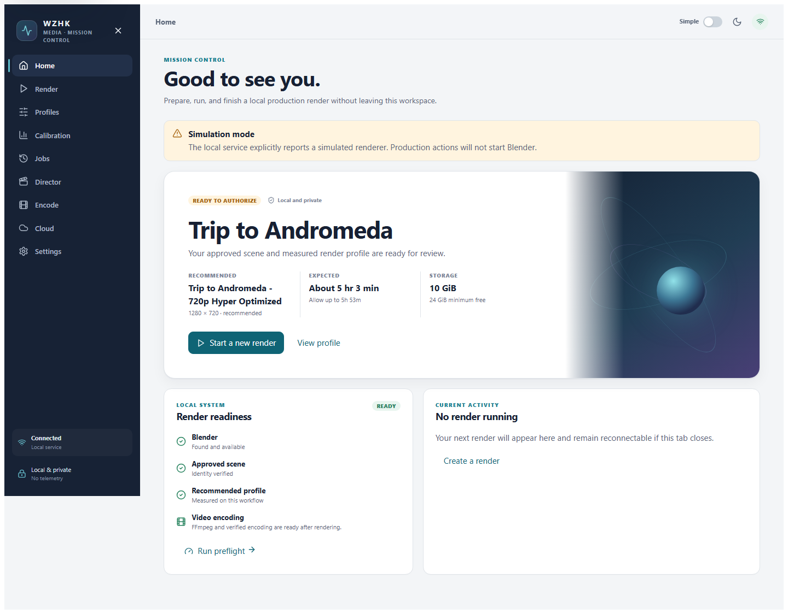
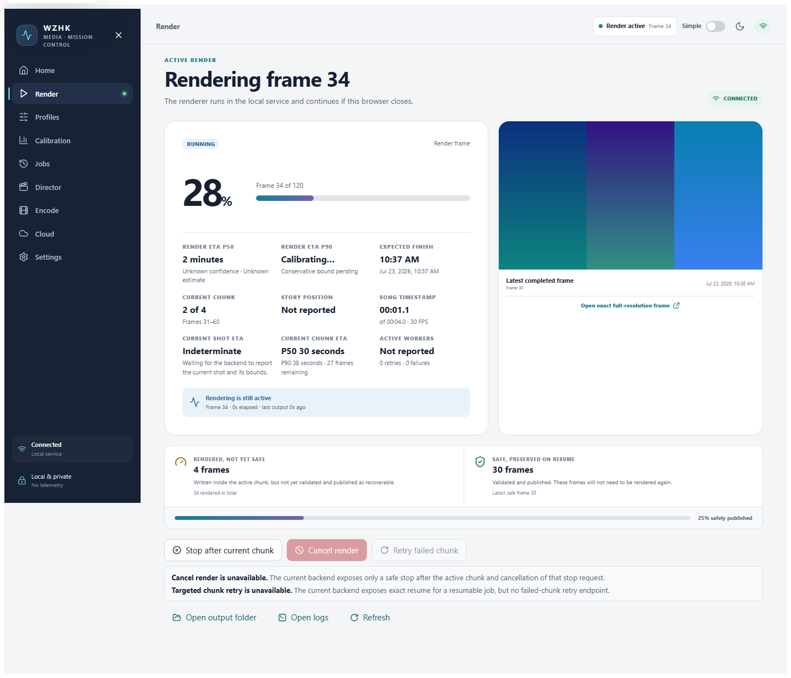

# WZHK Media Mission Control user guide

The **Director** navigation item opens the local Cinematic Visualizer V2 review workspace. It shows story acts, shot intent, representative review frames, prior findings, and approve/revise state. Saving a review updates only the local UUID job artifact atomically; it does not contact an external service. An empty Director screen means no completed local V2 plan is available yet.

Mission Control is designed so the normal local workflow does not require a
PowerShell command, JSON edit, hash, Blender command, or authorization token.
The finish-line V2 package has additional package-level and output-matrix gates;
operators must also follow the [Andromeda V2 production
runbook](andromeda-v2-production-runbook.md).

## Launch

Double-click `WZHK-Media-Launcher.cmd`.

The launcher reopens a healthy existing instance when possible. Otherwise it
selects an available local port, starts the backend, waits for it to become
ready, and opens the app. You can close the browser and return with the same
launcher; an active render continues in the backend.

## Start a saved-profile render

These steps apply to a scene/profile exposed by the current local service. Do
not substitute a lower-resolution historical profile for the Andromeda V2
horizontal master. The V2 runbook remains authoritative for that package, and a
generic Mission Control **Authorized** badge is not a substitute for the exact
V2 technical authorization and operator-start gate.

1. Choose **Start a new render** on Home.
2. Confirm the intended project and exact approved scene.
3. Choose the measured saved profile for the intended output. Resolution,
   composition, output variant, and profile identity are authorization inputs;
   changing any of them requires a new forecast and authorization.
4. Choose **Browse**, select a destination, and review its classification.
   - An empty folder can be used directly.
   - A matching prior render can resume.
   - When files conflict, Mission Control lists them and offers **Create a new
     render folder here**.
5. Choose **Run preflight**. Resolve any red check; amber authorization status
   is handled in the next step.
6. Choose **Authorize now** if shown.
   - First choose **Review and continue** after checking the summary.
   - Select **I understand this authorizes a full production render**, then
     choose **Authorize render**.
7. Choose **Start render**. Use **Run dry-run** instead when you only want to
   inspect the resume plan.

Mission Control creates the exact authorization record; do not copy the token
from Advanced details into another profile or scene. For a V2 matrix, also
confirm every enabled output variant and its composition/profile identity. A
scene/profile authorization from the wizard does not authorize a different
package release or variant set.

## Andromeda V2 output variants

The required default is authored horizontal 1920 × 1080 at 30 FPS. Authored
vertical 1080 × 1920 at 30 FPS is optional and disabled by default. Vertical is
not a crop, stretch, or reframe of the horizontal master.

Enabling vertical is a pre-production configuration decision. It adds another
13,029-frame render/encode/QA stream, disk requirement, calibration, and ETA.
It therefore requires a new aggregate 24-hour forecast, technical
authorization, and operator-start gate. The current Andromeda wrapper's
`-EnableVertical` option deliberately fails closed until those artifacts exist.
Never toggle the matrix after authorization or after a job starts.

## Follow progress

The live view shows the exact enabled output matrix. When more than one variant
is enabled, the selector switches the visible preview and telemetry stream; it
does not enable or disable work. For the selected variant, the dashboard shows
the actual latest completed rendered/in-flight frame, the latest validated safe
frame, current frame, act, shot, song timestamp, worker/chunk state, retries and
failures, resource telemetry, stage progress, and P50/P90 ETA. Aggregate
progress and ETA include only enabled variants.

**Rendered/in-flight** frames belong to an unpublished chunk. **Safe** frames
were validated and published, so a resume will not render them again. The
preview is generated from the exact completed frame and links to that variant's
corresponding full-resolution image.

During a long frame the heartbeat continues with current-frame elapsed time and
renderer status. **Reconnecting** means the browser is restoring its stream;
the last known state stays visible and the render is not restarted.

Choose **Request stop after current chunk** for a recoverable stop. The renderer
finishes, validates, and publishes that chunk before pausing. You may cancel the
request before it is honored. A safely paused job appears under Jobs with
**Resume**. Destructive **Cancel render** and targeted **Retry failed chunk**
remain disabled because the current backend exposes neither operation. Use safe
stop and exact resume; do not kill Blender, delete locks/in-flight directories,
or remove successful frames to simulate those actions.

## Encode and open the result

After all expected frames are verified, choose **Encode video** to review the
sequence and local FFmpeg readiness. Choose **Encode delivery + master** to run
the reviewed outputs in order: the H.264 delivery MP4 first, followed by the
ProRes 422 HQ master with lossless PCM audio. Mission Control shows overall
progress, the active output, encoded frame count, FFmpeg rate and speed, an
estimated time remaining, final verification, and links to each published
file. The image sequence remains the master clock and approved audio is read
only from its saved local path.

Refreshing the browser does not restart an encode. Return to **Encode** to
inspect its persisted status. Mission Control never overwrites an existing
final media file; failed temporary output and logs remain available for
diagnosis.

## Calibration

The existing measured profiles do not require another 73-candidate run. The
Calibration page shows the machine, latest evidence, recommendation, finalist
comparison, and documented caveats. It can save a new bounded offline plan.
Candidate execution and review persistence are intentionally reported as
unavailable until their existing tooling is connected to the local API; use
the preserved legacy interface for those actions. A missing historical plan
is shown as a recoverable error rather than closing Mission Control.

## Maximize local render performance

Settings offers **Maximize local render performance**. After explicit
confirmation it uses the Windows High Performance plan, prevents sleep, and
uses High (never Realtime) Blender priority. Review AC power and temperature.
Mission Control records and restores the previous state afterward; **Restore
now** is available when manual recovery is needed.

## Video generation

The **Video** page turns one completed TrackPrompt analysis into a complete provider-generated music video without creating a second dashboard or job system.

Select the analysis, content package, and delivery profile. Fast 1080p is the default final target and standard 1080p is the optional higher-quality rerender. The 4K profile remains visible but unavailable because the current GA Veo endpoints accept only 720p/1080p; enabling 4K requires a newly reviewed supported model contract. Enter the GCP project and private bucket, then select the original local audio master when the analysis job does not retain it.

The Video screen also exposes the provider-neutral continuity profile, a master seed lock/new-seed control, continuity groups, and an optional private JPEG/PNG first-frame reference. Same-setup retry preserves seed and references. New-variation retry changes the seed and plan digest and therefore returns to plan review for a new authorization phrase. After accepting a verified shot, its final frame can be chained to its declared next shot; that reference change also requires fresh authorization.

**Compile exact video plan** is local and nonbillable. Review every prompt, the exact provider request list, dated price rate, base/conservative estimates, hard maximum, and digest. The authorization button remains disabled until the displayed one-time phrase is entered exactly. **Start smoke shot and complete batch** is a separate action and the first one permitted to submit a paid request.

Mission Control runs shot 001 first using the same exact profile and plan. When that clip downloads and passes local resolution/FPS/duration/no-audio verification, it continues the remaining shots automatically. Per-shot cards show attempts, safe failures and filters, previews, accept/reject, and bounded retry. **Cancel batch safely** stops continuation without deleting evidence or valid clips.

When generation is technically complete, Mission Control resolves the full-song timeline against the original local audio, exports FCPXML/XML/EDL/edit-sheet/marker files, and assembles a complete preview. Open the output in DaVinci Resolve for final artistic touches. Refreshing the browser only reconnects to backend-owned SSE state; it never restarts or duplicates a provider attempt.

## Cloud rendering

The Cloud page is inspection-only until its local package registry and a live
Brev environment are verified. It reports local tooling, CLI readiness,
sanitized-package status, and the offline planning boundary. Package creation,
validation, provisioning, and fleet actions are disabled; none of these
states represents a running cloud job or contacts a billable service.

## Advanced details and legacy fallback

Enable Advanced details only when diagnosing a problem or confirming an exact
identity. It reveals hashes, local paths, process identity, raw logs, and the
authorization token without changing safety.

If the React launcher cannot be repaired immediately, use
`WZHK-Media-Launcher-Legacy.cmd`. The legacy PowerShell TUI remains a fallback,
not the preferred workflow.
