# Render operation architecture and SaaS extraction boundary

TrackPrompt has one final-render lifecycle. Mission Control, the persistent
backend job store, the render worker, frame validation, FFmpeg encoding, and
media QA all participate in that lifecycle. A story or preset may supply
content, but it must not create a second scheduler, dashboard, state database,
or authorization path.

This document describes the reusable operation. The Andromeda-specific operator
steps are in [Andromeda V2 production runbook](andromeda-v2-production-runbook.md).
Neither document grants production authorization or starts a render.

## Canonical lifecycle

```mermaid
flowchart LR
    Content["Story, shots, look, and composition profiles"] --> Matrix["Versioned output matrix"]
    Matrix --> Forecast["Calibration, disk, and P50/P90 forecast"]
    Forecast --> Technical["Technical authorization"]
    Technical --> Operator["Separate operator start gate"]
    Operator --> Scheduler["Persistent Mission Control scheduler"]
    Scheduler --> Workers["Local or explicitly configured workers"]
    Workers --> Inflight["Variant-scoped in-flight frames"]
    Inflight --> Preview["Real completed-frame preview"]
    Inflight --> Validate["Frame validation"]
    Validate --> Published["Atomic variant-scoped publication"]
    Published --> Encode["Variant-scoped FFmpeg encode"]
    Encode --> QA["Media QA and atomic final publication"]
```

The normal local system remains browser → loopback FastAPI → persistent backend
state. The browser displays and controls backend-owned state; it does not infer
progress by scanning folders or calculate its own production ETA.

## Versioned output matrix

An output matrix is an ordered set of typed variants. Each variant carries a
stable ID, enabled and required state, dimensions, FPS, authored composition
mode, deliverable role, composition/camera identity, render profile identity,
frame namespace, encoding contract, QA result, and progress/ETA state.

For Trip to Andromeda V2:

| Variant | Default | Contract |
| --- | --- | --- |
| `horizontal-16x9-1080p` | Enabled and required | 1920 × 1080, 30 FPS, authored primary master |
| `vertical-9x16-1080p` | Disabled and optional | 1080 × 1920, 30 FPS, authored optional social output |

Disabled means no render, encode, validation, storage, progress, or ETA workload.
It does not mean hidden background rendering. Enabling or disabling any variant
changes the output-matrix identity and invalidates a forecast or authorization
created for a different set.

The live dashboard's output-variant selector chooses which already-enabled
preview and telemetry stream is visible. It is not an enablement switch and
must never mutate an authorized matrix after a job starts.

## Shared story, independent compositions

Variants share story timing, audio synchronization, act and shot identity,
protagonist state, deterministic seeds, and event intent. They may independently
override camera, lens, framing, subject occupancy, foreground placement, safe
zones, and selected environment layout.

A vertical output must not be created by center-cropping, stretching,
letterboxing, or blindly reframing the horizontal master. Each enabled variant
must resolve through its own authored composition profile and pass separate
framing, safe-zone, landmark-visibility, subject-occupancy, and mobile-readability
QA. Narrative continuity is shared; object placement is allowed to differ.

## Persistent progress and real-frame preview

Every renderer event is routed by job, task, chunk, worker, and output-variant
identity. Events for a disabled, unknown, cross-format, or stale identity are
rejected.

After Blender completes a stable frame, the backend may expose it as
rendered/in-flight before the surrounding chunk is safe. A proxy is generated
from that exact frame outside Blender and atomically replaces the selected
variant's latest preview. Preview failure is recorded but does not fail the
render. Later validation promotes the frame to published/safe status.

Mission Control distinguishes:

- the frame currently being rendered;
- the latest completed rendered/in-flight frame;
- the latest validated safe frame;
- per-variant and aggregate completed/total work;
- per-stage, per-variant, and aggregate P50/P90 ETA;
- active workers, retries, failures, resource telemetry, act, shot, and song
  timestamp.

Unknown work is `calibrating` or `indeterminate`; it is not assigned a fabricated
percentage. Closing or refreshing the browser does not restart a job or lose its
persisted stream position.

## Identity and authorization layers

Creative acceptance, technical readiness, and permission to start are separate:

1. **Creative acceptance** locks the project-level look and motion target. It
   does not waive QA or authorize rendering.
2. **Technical authorization** binds source revision, media/content hashes,
   scene and profile identities, the exact enabled output matrix, calibration,
   disk/VRAM checks, dependencies, evidence, forecasts, and worker requirements.
3. **Operator start authorization** is a separate explicit decision bound to the
   exact technical release identity.

Changing a scene, profile, composition/camera, story or shot plan, output
variant, frame range, FPS, encoding contract, or bound content hash requires a
new forecast and authorization. A dashboard badge or a scene/profile token from
a different identity cannot substitute for the V2 package-level gates.

## Isolation, resume, and rollback

Each enabled variant has a separate frame directory, in-flight namespace,
preview stream, manifest, encoding output, and QA result. Valid published frames
are immutable for their identity. Resume scans and skips verified frames; it
does not overwrite them or mix frames from another variant or release.

A safe stop is checked at chunk boundaries, after validation and atomic
publication. Rollback means selecting an earlier complete, hash-bound package or
deploying an earlier application release without mutating active render state.
It never means deleting successful frames, rewriting immutable evidence, editing
an authorization in place, clearing a mutex, or forcing a mismatched resume.
See the [operator runbook](andromeda-v2-production-runbook.md#safe-stop-resume-and-rollback).

## Reusable module boundary

The platform/content split is:

| Layer | Reusable responsibilities | Project-specific responsibilities |
| --- | --- | --- |
| Contracts | Output variants, stages, workers, tasks, chunks, ETA, events, manifests, authorization | Story/look/composition configuration values |
| Orchestration | Scheduling, persistence, retry/resume, validation, publication, encoding, QA | Shot-level complexity assignments and content identities |
| UI | Variant-aware progress, preview, ETA, controls, diagnostics | Display labels and project artwork |
| Workers | Identity validation, deterministic execution, frame reporting | Scene builders and authored assets |
| Deployment | Local paths, tenant metadata, adapters, retention policy | Operator-selected project/package |

Andromeda logic belongs in its story, look, preset, composition profiles, and
production package. Generic Mission Control services must accept future
resolutions, aspect ratios, durations, art styles, and projects without adding
Andromeda branches.

## WZHK Media SaaS extraction and privacy boundary

The repository currently supports a local-first, single-operator deployment.
Calling the render operation SaaS-ready means its contracts and seams are
tenant-neutral; it does not mean this checkout is a hosted multi-tenant service.

Legal entity, brand, tenant, customer, and billing identity are deployment
metadata. They must not be hardcoded into generic source, worker protocol,
artifact names, frame paths, public telemetry, or open-source manifests.
Sensitive deployment metadata belongs in an external configuration/secret
boundary and must be redacted from logs and events.

Local audio, cue data, exact transcriptions, private asset paths, credentials,
and generated frames remain outside Git. The normal local workflow makes no
outbound request. The baseline lifecycle is defined in [Privacy and data
lifecycle](privacy.md). Cloud or remote workers are optional adapters, disabled
by default, and require the separate [cloud render privacy](cloud-render-privacy.md)
review, sanitized packages, credentials, cost authorization, and explicit
operator action. No implementation sprint or technical authorization may
silently provision billable infrastructure.

Before a hosted multi-tenant deployment, the product must separately implement
and review tenant authentication/authorization, storage and database isolation,
secret management, audit access controls, per-tenant retention/deletion,
network policy, quota/billing controls, signed worker trust, incident recovery,
and jurisdiction-specific compliance. Those hosted controls are not implied by
the local render contracts.

## Production-safety invariant

Building, testing, calibrating, deploying Mission Control, creating bounded
proofs, or generating a technical authorization is not permission to launch a
13,029-frame production render. Only the exact operator start gate may cross
that boundary.
